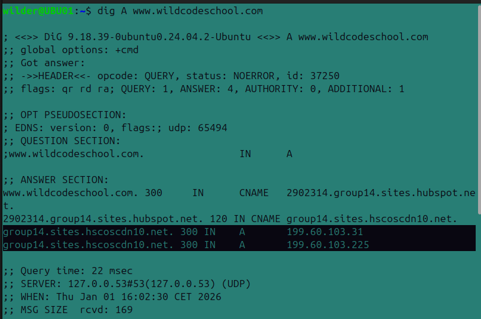
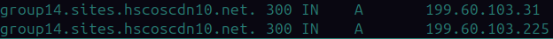
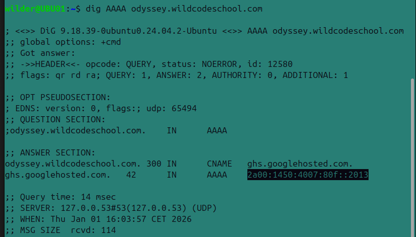
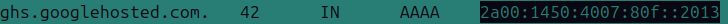
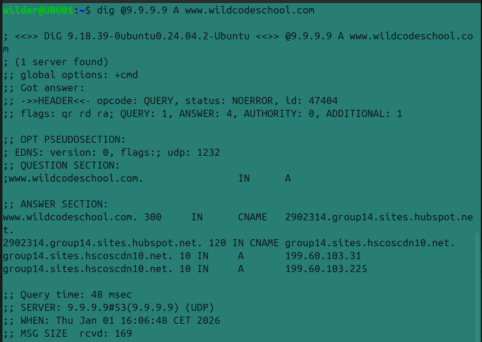
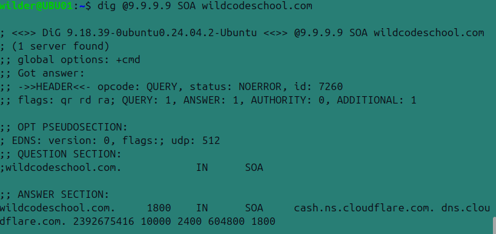
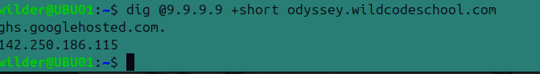

### les adresses IPV4 www.wildcodeschool.com

 

addrese ip site :

 

### les adresses IPV6

 

addrese ip site :

et l'hébergeur est Google 

### (Bonus) les noms des serveurs de noms faisant autorité sur le domaine wildcodeschool.com et le serveur primaire. 

 

 

 