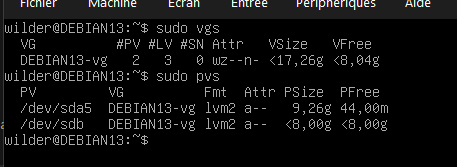
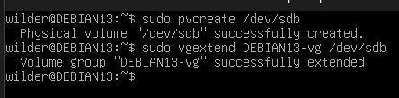
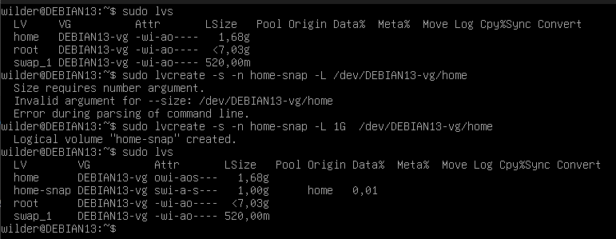
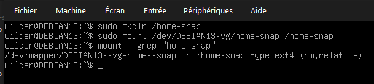
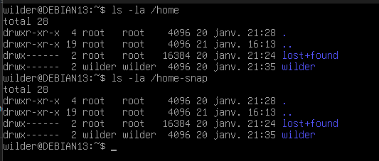
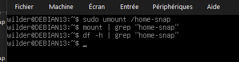
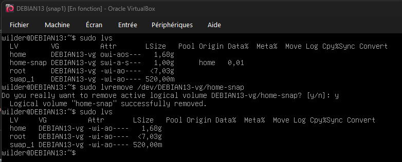

## LVM

### Ajout d'un PV et création snapshot

 

### Création snapshot LV /home 
 

### Création du dossier home-snap et montage 
 

### Contenu identique 
 

### Démontage et vérification 
 

### Snapshot supprimé
